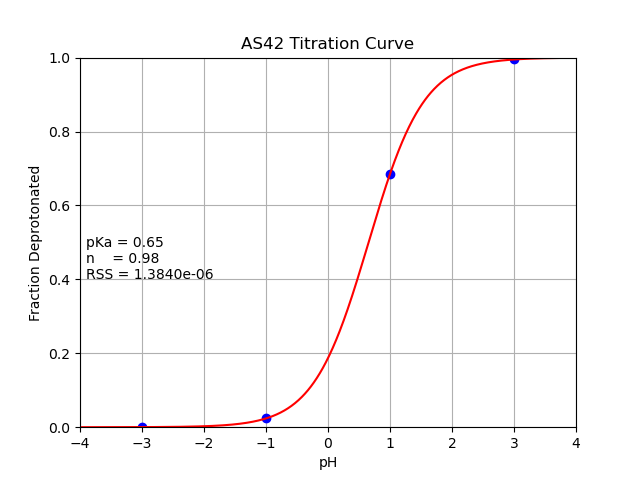

# Step-by-step Procedure to Reproduce AS4 Reference Energy

# Background

The key formula here is the following:

$$
\Delta G_{ref} = \Delta G_{TI} - R T \ln 10 pKa_{ref}
$$

The first thing we do is plug in a "dumb" energy guess, titrate with CpHREMD and
compute the "dumb" pKa, and compute $\Delta G_{TI}$ using the formula above.

This is an "intrinsic" value for the force field. You can then compute the
$\Delta G_{ref}$ you *want* by plugging in the $\Delta G_{TI}$ you computed in
the first step, the $pKa_{ref}$ you *want*, and get the exact reference free
energy in a single step (assuming you can fit a titration curve).

The "dumb" energy we're going to use is just a minimized energy difference
between the two protonation states. If this is a reasonable approximation of
$\Delta G_{TI}$, then titrating will yield a pKa value around 0.

## Computing the $\Delta E_{dumb}$

### Create the reference compound

```bash
$ tleap -f make-ref-as4.tleap
```

This will create 3 files: `as4_ref.parm7`, `as4_ref.rst7`, and `leap.log`. The
last file can be deleted.

### Minimize and compute the energy difference

Note you need to must have edited
`AmberTools/src/parmed/parmed/amber/titratable_residues.py` to add the charges
you want for your residue (this is already done for AS4).

The `dumb-energy.pmd` ParmEd script will minimize the structure, print the
energy for protonation states 0 (deprotonated) and 1 (O2-syn position protonated).

Running this script gives the following output (the minimization details printed
by scipy have been elided):

```bash
$ parmed -n -i dumb-energy.pmd
['dumb-energy.pmd']
Reading actions from dumb-energy.pmd

Adding prmtop as4_ref.parm7 to parm list. as4_ref.parm7 is the active parm.
Loading restart file as4_ref.rst7
Minimizing as4_ref.parm7 with GB(OBC1) and no cutoff to a tolerance of 0.001. Using at most 1000 minimization steps.
RUNNING THE L-BFGS-B CODE

           * * *

Machine precision = 2.220D-16
 N =           84     M =           10
 This problem is unconstrained.
... snip scipy LBFGS output
CONVERGENCE: REL_REDUCTION_OF_F_<=_FACTR*EPSMCH
Changing protonation state of residue 2 (AS4) to 0
Computing a single-point energy for as4_ref.parm7
Bond     =            0.7044460     Angle    =            4.3719221
Dihedral =            8.7220402     1-4 vdW  =            2.9635578
1-4 Elec =           66.5731895     vdWaals  =           -2.8657787
Elec.    =         -107.1007953     Egb      =          -92.4818031
TOTAL    =         -119.1132214
Changing protonation state of residue 2 (AS4) to 1
Computing a single-point energy for as4_ref.parm7
Bond     =            0.7044460     Angle    =            4.3719221
Dihedral =            8.7220402     1-4 vdW  =            2.9635578
1-4 Elec =           19.0750724     vdWaals  =           -2.8657787
Elec.    =          -98.9219809     Egb      =          -25.3858462
TOTAL    =          -91.3365671
Writing coordinates to as4_ref.min.rst7 as type RESTART
Done!
```

Your values may differ a little depending on the final structure the minimizer
solves, but this will be close. Assigning the deprotonated state to an energy of
0 (as is standard for CpHMD), the energy of the protonated state becomes 27.776654.

If you compare this to the `igb = 2` reference energy in
`titratable_residues.py`, you can see this is actually quite close already (less
than 1 kcal/mol different):

```python
refene2 = _ReferenceEnergy(igb1=21.4298008, igb2=26.8894581, igb5=26.5980488,
                 igb7=23.4181107, igb8=26.3448911)
```

**DELTA E dumb = 27.7767**


## Computing the pKa

Using this value directly will titrate to a pKa around 0.

Let's create the cpin file and set the state energies for the protonated states
to 27.7767. Create the cpin file with the following command:

```bash
$ cpinutil.py -p as4_ref.parm7 -o as4_ref.cpin
CPIN generation complete!
```

Make sure to set the `PKA_CORR` value to 0 for each state, and the cpin file
should look like the following:

```
&CNSTPHE_LIMITS
 ntres=1, maxh=5, natchrg=80, ntstates=5,
/
&CNSTPH
 CHRGDAT=-0.4157,0.2719,0.0341,0.0864,-0.1783,-0.0122,-0.0122,0.7994,-0.8014,
 -0.8014,0.0,0.5973,-0.5679,0.0,0.0,0.0,-0.4157,0.2719,0.0341,0.0864,-0.0316,
 0.0488,0.0488,0.6462,-0.5554,-0.6376,0.4747,0.5973,-0.5679,0.0,0.0,0.0,-0.4157,
 0.2719,0.0341,0.0864,-0.0316,0.0488,0.0488,0.6462,-0.5554,-0.6376,0.0,0.5973,
 -0.5679,0.4747,0.0,0.0,-0.4157,0.2719,0.0341,0.0864,-0.0316,0.0488,0.0488,
 0.6462,-0.6376,-0.5554,0.0,0.5973,-0.5679,0.0,0.4747,0.0,-0.4157,0.2719,0.0341,
 0.0864,-0.0316,0.0488,0.0488,0.6462,-0.6376,-0.5554,0.0,0.5973,-0.5679,0.0,0.0,
 0.4747,
 PROTCNT=0,1,1,1,1,
 RESNAME='System: Unknown','Residue: AS4 2',
 RESSTATE=0,
 STATEINF(0)%FIRST_ATOM=7, STATEINF(0)%FIRST_CHARGE=0,
 STATEINF(0)%FIRST_STATE=0, STATEINF(0)%NUM_ATOMS=16, STATEINF(0)%NUM_STATES=5,
 STATENE=0.000000,27.7767,27.7767,27.7767,27.7767,
 PKA_CORR=0.0000,0.0000,0.0000,0.0000,0.0000,
 TRESCNT=1,
/
```

### Running REMD

Using the provided `groupfile` and `mdin.*` files, execute sander with the
following command:

```bash
$ mpirun -np 4 sander.MPI -ng 4 -groupfile groupfile -remlog rem.log -rem 4
```

### Using `cphstats` to compute pKa

The first thing you need to do when analyzing the protonation fraction is
reorder the cpout files:

```bash
$ cphstats -i as4_ref.cpin --fix-remd cpout-reordered cpout.*
```

The reordered cpout files (`cpout-reordered.pH_-3.00`,
`cpout-reordered.pH_-1.00`, `cpout-reordered.pH_1.00`, and
`cpout-reordered.pH_3.00`) can be used to compute protonation fractions at each
pH:

```bash
$ for ph in -3 -1 1 3; do cphstats -i as4_ref.cpin cpout-reordered.pH_${ph}.00; done
Solvent pH is   -3.000
AS4 2   : Offset  3.611  Pred  0.611  Frac Prot 1.000 Transitions        94

Average total molecular protonation:   1.000
Solvent pH is   -1.000
AS4 2   : Offset  1.616  Pred  0.616  Frac Prot 0.976 Transitions      6502

Average total molecular protonation:   0.976
Solvent pH is    1.000
AS4 2   : Offset -0.337  Pred  0.663  Frac Prot 0.315 Transitions     25684

Average total molecular protonation:   0.315
Solvent pH is    3.000
AS4 2   : Offset -2.390  Pred  0.610  Frac Prot 0.004 Transitions       484

Average total molecular protonation:   0.004
```

You can fit a titration curve to these data to compute the pKa. The following
data file (`deprot-fracs.txt`) contains the pH vs. deprotonation fraction for
the titratable residue (note that this is the *deprotonation* fraction):

```
# pH     AS42
-3.00  0.000
-1.00  0.024
1.00   0.685
3.00   0.996
```

You can use the following Python script to compute the pKa:

```python
from scipy.optimize import curve_fit
import numpy as np


def f(ph, pka, n):
   return 1.0/(1.0+10.0**(n*(pka-ph)))

pHs = np.array([-3.0, -1.0, 1.0, 3.0])
frac_deprot = np.array([0.000, 0.024, 0.685, 0.996])

params, covariance = curve_fit(f, pHs, frac_deprot)

print(f"pKa = {params[0]}; n (hill coeff.) = {params[1]}")
```

Running this gives the following output:

```bash
$ python fit-titration-curve.py
pKa = 0.6541094237264861; n (hill coeff.) = 0.9757034290351828
```

(You can use the `titration_curve_fit.py` script from
https://github.com/swails/JmsScripts to plot the titration curve and actually
see the fit, shown below via `python titration_curve_fit.py -i deprot-fracs.txt`).



### Correcting the reference energy

Knowing in this experiment that $\Delta G_{ref} = 27.7767$ and the pKa converged
to 0.6541094..., we can calculate $\Delta G_{TI}$ as:

```python
>>> import math
>>> 27.7767 - (8.31441 / 4.184e3 * 300 * math.log(10) * 0.6541094237264861)
26.878801780816985
```

You can see that this has excellent agreement with the production value
specified in parmed of 26.8894581.


## Computing explicit solvent reference energies

When computing for explicit solvent, this is when the above strategy becomes
most useful for three reasons:

1. Because protonation state changes are attempted in GB, but conformations
propagated in explicit solvent, there is no single Hamiltonian in which you
can execute a TI or FEP calculation to get the correct free energy.
2. Protonation state sampling is much less efficient in explicit solvent
relative to implicit solvent, so doing pH-REMD is required to get a
well-converged result for your titration curve.
3. Each replica simulation is much more expensive because of the explicit
solvent and the added cost of the method (relaxation dynamics following
successful protonation state changes, etc.). As a result, you want to be able to
calculate the correct reference energy after running only a single, high-quality
titration in explicit solvent.


A few notes here:

* A reasonable starting point for the reference energy is the value used in
implicit solvent. Alternatively, compute the dummy-energy of the reference
compound *without water* the same way we did for AS4, and start with that.

* The size of the water box is not terribly important. Just make it large enough
that the charge redistribution that's done implicitly by PME doesn't introduce
huge artifacts. It also has to be big enough for an 8 A cutoff in dynamics.
